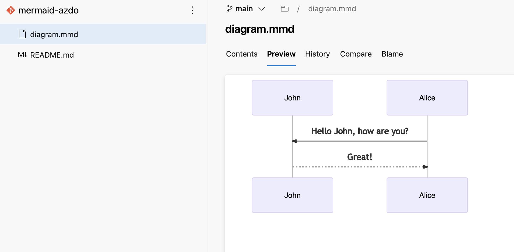

# Azure DevOps Extension: Mermaid Renderer

This repo contains source codes to [Mermaid Renderer Extension for Azure Devops](https://marketplace.visualstudio.com/items?itemName=xinyi-joffre.mermaid-renderer)

## Build Locally

1. Run `npm install`
2. Install TFX cross platform command line interface (CLI): `npm i -g tfx-cli`
3. Run `tfx extension create --manifest-globs vss-extension.json`

## Usage

Install this extension to your Azure DevOps Organization.

Choose any Mermaid Diagram (`.mmd`) file in your repo. The preview pane will show the rendered content of Mermaid Diagram.

Select a `.mmd` containing a mermaid diagram:

Click on the `Preview` tab to see the rendered diagram:

The extension leverages the latest Mermaid version available from CDN, so new features should be available as soon as they are released.

## Contributing

This project welcomes contributions and suggestions.
